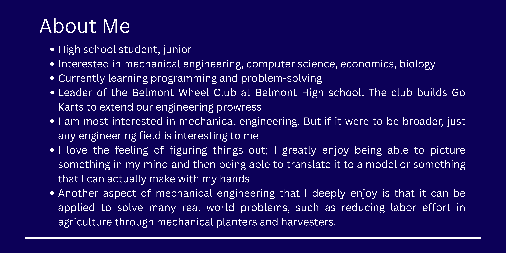

## RafaMarquez6.github.io

  

  

Hi, I'm Rafael 👋

<h1 align="center">
  <a href="./projects.md">Projects</a>
</h1>

  

## Skills
- Languages: Python (learning), JavaScript (learning), HTML (learning)
- Tools: 3d modeling (Shapr3d), Welding

## Projects
👉 [View all my projects](./projects.md)
- Belmont Wheels club
- My first Go kart
- 2nd Go kart
- Mini Bike (short lived)
- The punisher (black go kart 3rd)
- Unamed (4th)

## Goals
- Build real-world projects
- Improve coding skills
- Learn more about tech + engineering

## Contact
- rafaelmarquez0420@gmail.com
