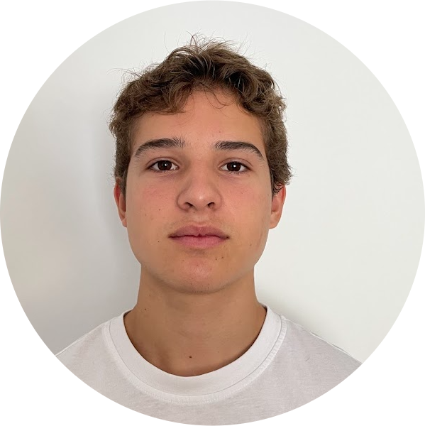

## RafaMarquez6.github.io

  

Hi, I'm Rafael 👋

<h1 align="center">
  <a href="./projects.md">Projects</a>
</h1>

##  About Me
- High school student, junior
- Interested in  mechanical engineering, computer science, economics, biology
- Currently learning programming and problem-solving
- Leader of the Belmont Wheel Club at Belmont High school. The club builds Go Karts to
  extend our engineering prowress
- I am most interested in mechanical engineering. But if it were to be broader, just
  any engineering field is interesting to me
- I love the feeling of figuring things out; I greatly enjoy being able to picture
  something in my mind and then being able to translate it to a model or something that
  I can actually make with my hands
- Another aspect of mechanical engineering that I deeply enjoy is that it can be applied
  to solve many real world problems, such as reducing labor effort in agriculture through
  mechanical planters and harvesters. 

## Skills
- Languages: Python (learning), JavaScript (learning)
- Tools: Git, GitHub, VS Code

## Projects
👉 [View all my projects](./projects.md)
- Belmont Wheels club
- My first Go kart
- 2nd Go kart
- Mini Bike (short lived)
- The punisher (black go kart 3rd)
- Unamed (4th)

## Goals
- Build real-world projects
- Improve coding skills
- Learn more about tech + engineering

## Contact
- rafaelmarquez0420@gmail.com
